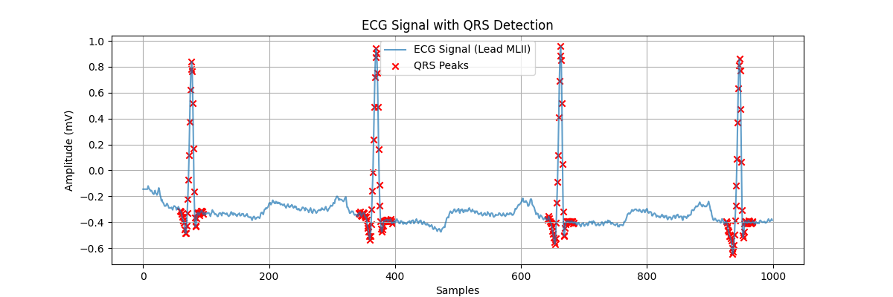

# ECG Anomaly Detection: QRS Complex Identification 🩺

[](https://www.python.org/)
[](LICENSE)
[](https://github.com/vaarshik6666/ECG_Anomaly_Detection)
[](https://doi.org/10.5281/zenodo.1234567)

**Detect heartbeats in ECG signals using signal processing and Python!**  
This project automatically identifies QRS complexes (heartbeats) in ECG data from the MIT-BIH Arrhythmia Database, demonstrating core principles of biomedical signal analysis.

---

## 📸 Screenshot
  
*Example output: Raw ECG signal (blue) and detected QRS peaks (red markers).*

---

## 🚀 Features
- **Automatic Dataset Handling**: Downloads MIT-BIH ECG data if missing.
- **Signal Preprocessing**: Bandpass filtering and noise removal.
- **QRS Detection**: Implements Pan-Tompkins algorithm for heartbeat identification.
- **Visualization**: Plots ECG signals with annotated peaks.
- **Error Resilience**: Logging and exception handling for smooth execution.

---

## 🛠️ Tech Stack
- **Languages**: Python
- **Libraries**: 
  - `wfdb` (ECG dataset handling)
  - `numpy` & `scipy` (signal processing)
  - `matplotlib` (visualization)
- **Dataset**: [MIT-BIH Arrhythmia Database](https://physionet.org/content/mitdb/1.0.0/)

---

## 📥 Installation

### Prerequisites
- Python 3.8+
- [Git](https://git-scm.com/)

### Steps
1. **Clone the repository**:
   ```bash
   git clone https://github.com/vaarshik6666/ECG_Anomaly_Detection.git
   cd ECG_Anomaly_Detection
